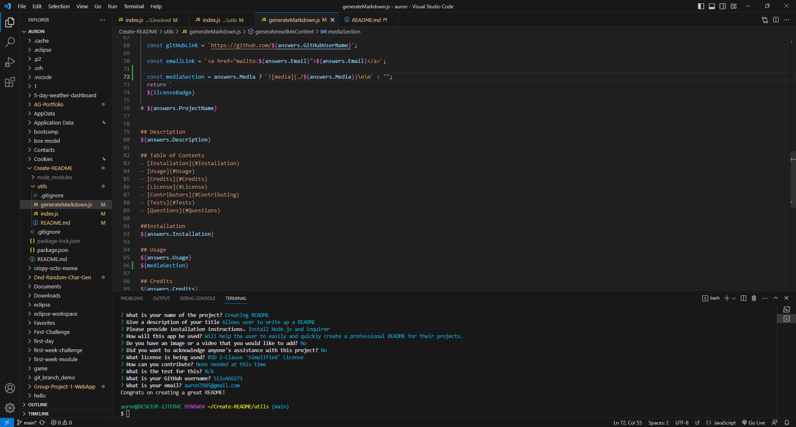
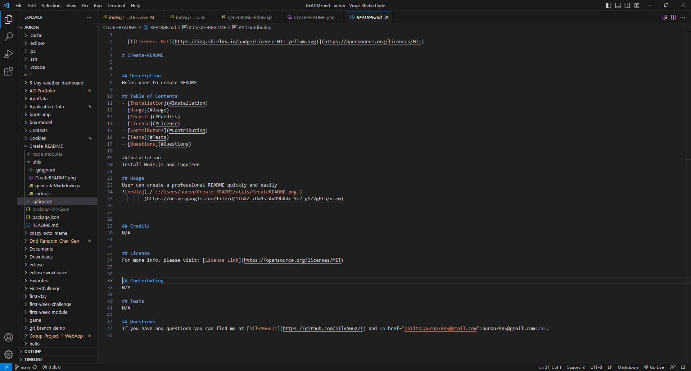

  

# Create-README

## Description
App to help the user to create a README.

## Table of Contents
- [Installation](#Installation)
- [Usage](#Usage)
- [Credits](#Credits)
- [License](#License)
- [Contributors](#Contributing)
- [Tests](#Tests)
- [Questions](#Questions)

## Installation
Install Node.js and inquirer.
  
## Usage 
User can create a professional README quickly and easily for all their projects.

(https://drive.google.com/file/d/1ThXZ-iUw9sLAvO9bXdk_YzZ_gSZ2gFtb/view)

## Credits
N/A

## License 
For more info, please visit: [License Link](https://opensource.org/licenses/MIT)

## Contributing
N/A

## Tests 
N/A at this time

## Questions 
If you have any questions you can find me at [silvAG6271](https://github.com/silvAG6271) and <a href="mailto:auron7985@gmail.com">auron7985@gmail.com</a>.
